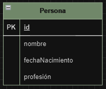

# Clases
La base de datos orientada a objetos se basa en la agrupación de información en conjuntos relacionados entre sí. En este enfoque, los datos de cada registro se encapsulan en un solo objeto, junto con todos sus atributos, en contraposición a la organización tabular de otras bases de datos. En las bases de datos orientadas a objetos, toda la información se encuentra disponible dentro del objeto, evitando así la distribución en filas y columnas.

Además, los métodos, es decir, las acciones que se pueden realizar en cada objeto, también se pueden organizar de manera conjunta.

Estos objetos, a su vez, se clasifican en clases, estableciendo una jerarquía de clases y subclases. En esta estructura, las subclases heredan las propiedades de las clases superiores y pueden añadir sus propios atributos. Sin embargo, esta jerarquía no es rígida, ya que los objetos de una clase pueden relacionarse con objetos de otras clases, formando redes. Además, los objetos simples pueden combinarse para crear objetos más complejos.

## Ejemplo

[Ejemplo de clase con Claves, Primarias y Alternativas, atributos compuestos, multievaluados y función](../Clases/clase.sql).