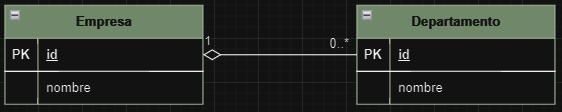
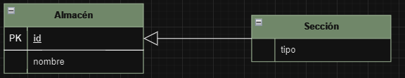

# Relaciones
En esta sección se tratarán la Agregación, Composición y Generalización.

## Agregación
La agregación es una relación entre dos clases donde una clase es parte de otra clase, pero ambas pueden existir de forma independiente. En otras palabras, una clase contiene a la otra, pero no están estrechamente ligadas de manera que la existencia de una dependa de la otra. La clase que contiene a la otra se conoce como la clase contenedora, y la clase que es contenida se llama la clase contenida.

[Ejemplo de Agregación](../Relaciones/agregacion.sql).

## Composición
La composición es una relación entre dos clases donde una clase es parte de otra clase y su existencia está estrechamente ligada a la existencia de la clase que la contiene. En otras palabras, si la clase contenedora es destruida, la clase contenida también lo será.

[Ejemplo de Agregación](../Relaciones/composicion.sql).

## Generalización
La generalización es un principio de la programación orientada a objetos donde se define una clase base (o superclase) que contiene atributos y métodos comunes a un conjunto de clases relacionadas (subclases). Las subclases heredan los atributos y métodos de la superclase y pueden agregar sus propios atributos y métodos específicos. La generalización permite la reutilización de código y la creación de jerarquías de clases. 

[Ejemplo de Agregación](../Relaciones/generalizacion.sql).